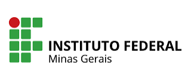

# 🐍 Python Básico — Trilha de Formação | +IFMG

<p align="center">
  
</p>

<p align="center">
  Repositório de estudos, práticas, exercícios e projetos desenvolvidos durante o curso
  <strong>Python Básico</strong>, oferecido pela plataforma <strong>+IFMG</strong>,
  do Instituto Federal de Educação, Ciência e Tecnologia de Minas Gerais.
</p>

---

## 📚 Sobre o curso

O curso **Python Básico**, oferecido pelo **Instituto Federal de Minas Gerais — IFMG**, apresenta os fundamentos da linguagem Python e os principais conceitos necessários para o desenvolvimento de programas básicos.

O curso possui carga horária de **40 horas**, modalidade **EaD autoinstrucional**, e integra uma trilha maior de formação em Python e Big Data.

| Informação | Descrição |
|---|---|
| 🏫 Instituição | Instituto Federal de Minas Gerais — IFMG |
| 🌐 Plataforma | +IFMG |
| 📘 Curso | Python Básico |
| 🐍 Linguagem | Python |
| ⏱️ Carga horária | 40 horas |
| 💻 Modalidade | Educação a Distância — EaD |
| 📚 Formato | Autoinstrucional |
| 🎯 Nível | Básico |
| 📅 Ano | 2026 |
| 📌 Status | 🚧 Em andamento |

---

## 🎯 Objetivos

Este repositório tem como objetivo registrar de maneira estruturada minha evolução durante o estudo dos fundamentos da linguagem Python.

Além do acompanhamento do conteúdo oficial, o projeto busca transformar teoria em prática por meio de exemplos, exercícios, experimentações, desafios e pequenos projetos.

---

## 🧠 Competências desenvolvidas

Ao longo da formação são trabalhados conhecimentos relacionados a:

- sintaxe e semântica da linguagem Python;
- tipos de dados;
- variáveis;
- entrada e saída de dados;
- expressões;
- operadores aritméticos;
- operadores relacionais;
- operadores lógicos;
- estruturas condicionais;
- estruturas de repetição;
- tratamento de exceções;
- decomposição de problemas;
- funções;
- módulos;
- strings;
- listas;
- tuplas;
- conjuntos;
- dicionários;
- resolução de problemas com programação.

---

## 🗺️ Organização do curso

### 1️⃣ Semana 01 — Fundamentos da linguagem Python

Conteúdos:

- introdução à linguagem Python;
- preparação do ambiente;
- tipos de dados;
- variáveis;
- blocos de código;
- entrada e saída de dados;
- expressões;
- operadores aritméticos;
- operadores relacionais;
- operadores lógicos;
- combinação de expressões.

➡️ [`semana-01/`](semana-01/)

---

### 2️⃣ Semana 02 — Estruturas de controle

Conteúdos:

- estruturas condicionais;
- tomada de decisão;
- estruturas de repetição;
- aplicação de condições e loops na resolução de problemas.

➡️ [`semana-02/`](semana-02/)

---

### 3️⃣ Semana 03 — Exceções, funções e modularização

Conteúdos:

- tratamento de exceções;
- decomposição de problemas;
- funções;
- parâmetros;
- retorno de valores;
- módulos;
- organização e reutilização de código.

➡️ [`semana-03/`](semana-03/)

---

### 4️⃣ Semana 04 — Coleções de dados

Conteúdos:

- strings;
- listas;
- tuplas;
- conjuntos;
- dicionários;
- manipulação de coleções.

➡️ [`semana-04/`](semana-04/)

---

## 📂 Estrutura do repositório

```text
ifmg-python-basic-trilha-40h/
│
├── assets/
├── semana-01/
├── semana-02/
├── semana-03/
├── semana-04/
├── desafios/
├── projetos/
├── materiais/
├── anotacoes/
├── .gitignore
├── LICENSE
└── README.md
